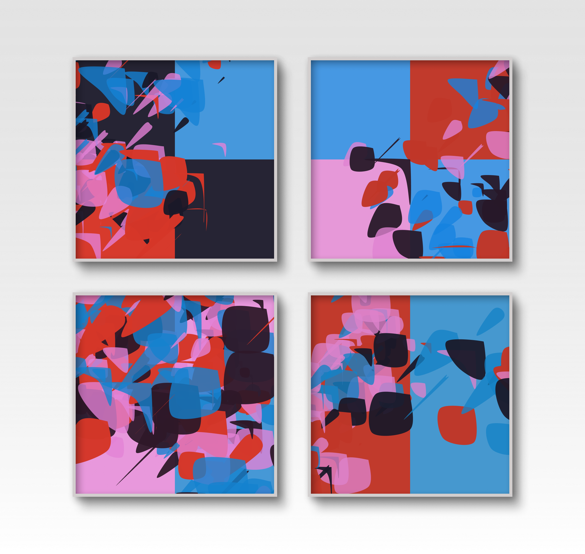

# collection-paralell
Collection of p5 sketches

```javascript
/** Dear Computer 
 * please imagine a list with four specific colors. 
 * Each color in the list is redefined as the color with a little random variation. 
 * Please define a shape as a fractal of the shape. 
 * Each shape moves the position randomly "along the recursion". 
 * Please define grid as randomly colored squares. 
 * Use shape and grid, then save an image for us. 
 * Thank you ("200 OK").
 */

// P5 & p5.js-svg
function setup() {
  createCanvas(800, 800, SVG);
  background(250, 230, 240);
  noStroke();
  const colors = [
    color(random(20, 50), 24, 40, 240),
    color(random(190, 230), 54, 40, 250),
    color(random(190, 230), 130, random(190, 230), 200),
    color(20, 130, random(190, 230), 200)
  ];
  const grid = (s) => {
    for (let x = 0; x < width; x += s) {
      for (let y = 0; y < height; y += s) {
        fill(random(colors));
        rect(x, y, s, s);
      }
    }
  };
  const leaf = (x, y, d, level) => {
    if (level == 1) return;

    const pointyNess = random(d / 4);
    const wide = random(d);
    const long = random(0, d);
    fill(random(colors));
    push();
    translate(x, y);
    rotate(PI / 2);
    beginShape();
    curveVertex(0, pointyNess);
    curveVertex(0, 0);
    curveVertex(wide, 0);
    curveVertex(long, long);
    curveVertex(0, wide);
    curveVertex(0, 0);
    curveVertex(pointyNess, 0);
    endShape();
    pop();
    leaf(x + random(-d, d), y + random(-d, d), d--, --level);
  };
  grid(400);
  leaf(400, 400, 130, 230);
  leaf(400, 400, 200, 130);
  save("leaf.jpg")
}

# Hängevorschlag

